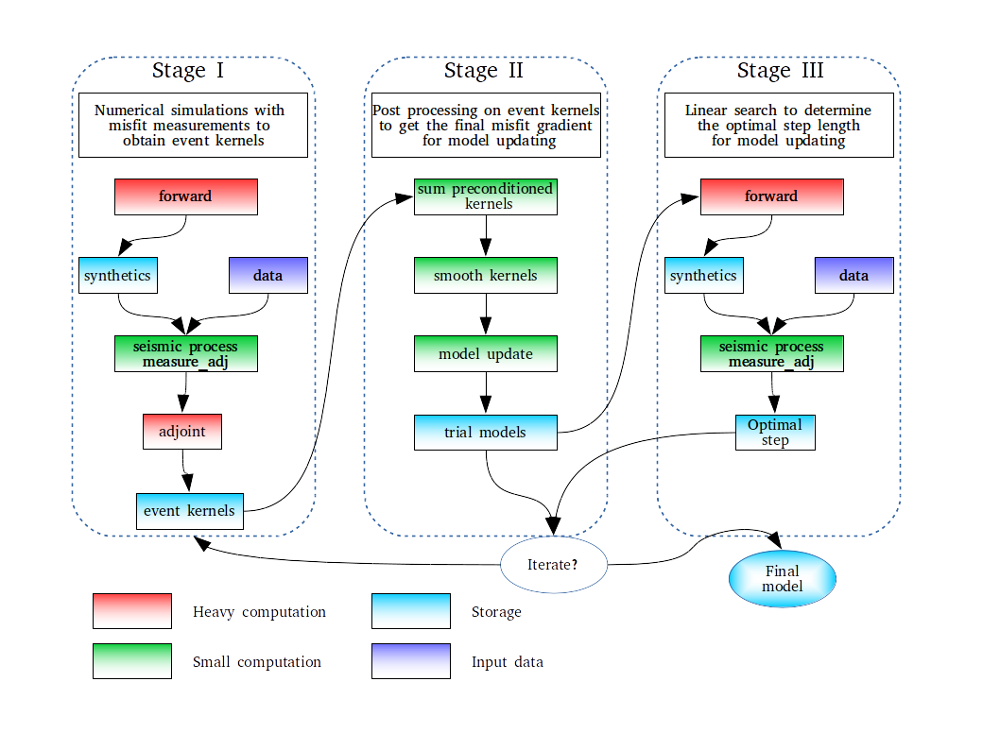

### SPECFEM3D_ANAT

## Overview
SPECFEM3D_ANAT is a shell-script driven inversion package of ambient noise adjoint tomography (ANAT). In this package, I build a flexible workflow for implementing adjoint tomography on clusters. The basic idea of ANAT is to iteratively minimize the traveltime misfit between empirical Green's functions (EGFs) from ambient noise and synthetic Green's functions (SGFs) from spectral-element simulations based on misfit gradient. According to the job submission schedule, it is divided into three stages. In stage one, I conduct the forward and adjoint simulation in one PBS job (including misfit measurement) to obtain the event kernel of each virtual source (or master station). After all the simulations are finished, event kernels are summed, preconditioned, and smoothed in stage two to obtain the final misfit gradient. In stage three, I use line search to determine the optimal step length for model updating. 

## Document

A simple manual is avaiable [here](doc/SPECFEM3D_ANAT.pdf). Also, if you want to know more about the method, I would kindly ask you to read my Ph.D. thesis [Adjoint Tomography of Surface Wave Observables from Ambient Seiemic Noise](doc/thesis_wang2018.pdf)

## Versioning

For the versions available, see the [tags on this repository](https://github.com/yuefeng9330/SPECFEM3D_ANAT/tags). 

## References

If you use this inversion package or benifit from our workflow, please cite our papers in the following.

For Rayleigh wave ANAT:

1. Wang K., Y. Yang, P. Basini, P. Tong, C. Tape, and Q. Liu, 2018. Refined crustal and uppermost structure of southern California by ambient noise adjoint tomography. Geophysical Journal International, 215(3), 844-863.

For Love wave ANAT:

2. Wang K., Q. Liu, and Y. Yang, 2019. 3D Sensitivity Kernels for Multi-component Empirical Green's Functions from Ambient Noise : Methodology and Application to Adjoint Tomography.

For multi-component ANAT to infer radial anisotropy:

3. Wang K., C. Jiang, Q. Liu, and Y. Yang, 2019. Crustal deformation of southern California constrained by seismic radial anisotropy from multi-component ambient noise adjoint tomography.

## Authors

* **Kai Wang** - *Initial work* - [Kai Wang](https://sites.google.com/view/kaikaiwang)

Please contact me (wangkaim8@gmail.com) if you want to participat in this project.

## License

This project is licensed under the GNU General Public License, Version 3 (GPLv3) - see the [LICENSE](LICENSE) file for details

## Acknowledgments

* Ｍacquarie University 
* SPECFEM3D community
* etc
